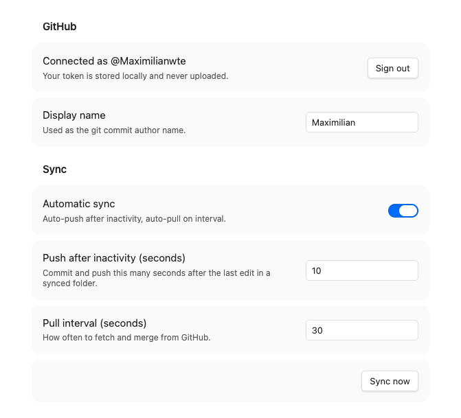

# CoNote Git

**Collaborate on Obsidian notes through GitHub — super simple, full data ownership, completely free.**

CoNote Git syncs individual vault folders with collaborators automatically. No manual commits, no subscriptions, no servers. Just a GitHub repo you already own.

You don't need to link a full vault, just where ever you want to collaborate in your Obsidian!

---

## Super simple & full data ownership

Most collaboration tools route your notes through someone else's servers. CoNote Git doesn't exist in the middle — your notes go directly from your vault to a GitHub repo you control, and to your collaborators' vaults. That's it.

- **Simple.** Your notes live in a GitHub repo that belongs to you. Delete the plugin tomorrow and your notes are still there, as plain git history.
- **Full privacy.** Use a private repo and nobody outside your collaborators can see anything. No analytics, no telemetry, no cloud accounts beyond GitHub.
- **Free forever.** GitHub private repos are free. The plugin is free and open source. There's nothing to pay for.

---

## How it works

Sign in with GitHub in one click — no tokens to generate or paste. CoNote Git handles auth via GitHub's official OAuth device flow (the same mechanism used by the GitHub CLI).

Each shared subfolder maps to its own independent GitHub repo. The rest of your vault is completely untouched.

```
Your vault/
├── Personal notes/        ← untouched, never synced
├── Shared/ProjectX/       ← backed by github.com/you/projectx
└── Shared/Research/       ← backed by github.com/group/research
```

**Push:** edit a file → 10s inactivity → auto-commit & push  
**Pull:** every 30s → fetch & merge silently  
**Conflict:** merge modal opens → you resolve → plugin commits & pushes

No raw conflict markers ever appear in your notes.




---

## Why not Obsidian Git?

Obsidian Git tracks your entire vault as one repo. CoNote Git lets you have **multiple independent shared subfolders**, each backed by a different repo, while the rest of your vault stays private and untracked. It also requires no system git installation — everything runs inside Obsidian.

---

## Setup

### 1. Install the plugin

Copy `main.js`, `manifest.json`, `styles.css` into:
```
<vault>/.obsidian/plugins/conote-git/
```
Enable in **Settings → Community plugins**.

### 2. Sign in

Open **Settings → CoNote Git** → click **Sign in with GitHub**. Your browser opens, you enter a short code, done. No passwords shared with the plugin.

### 3. Create a repo per shared folder (repo owner only, one-time)

Create a private repo on GitHub. Add collaborators under **Settings → Collaborators**. Each collaborator accepts the GitHub invite. That's the entire sharing setup.

### 4. Add a folder mapping

Click **Add folder mapping**, pick a vault folder, pick a GitHub repo, click **Clone / init**. Sync starts automatically.

---

## Conflict resolution

When two people edit the same lines between syncs:

1. The **Resolve conflict** modal opens automatically
2. Left pane: your version · Right pane: incoming version
3. Bottom: editable merged result
4. Use **"Use mine"** / **"Use theirs"** or edit freely
5. Click **Save & push**

---

## Architecture & MCP future

The sync logic lives in `src/core/` with no Obsidian imports, making it reusable outside the plugin. A planned MCP server will expose `push` / `pull` as tools so Claude can act as a named collaborator — appearing in git history like any other author, with no special infrastructure required.

---

## License

MIT © [Maximilian Witte](https://github.com/maximilianwitte)
